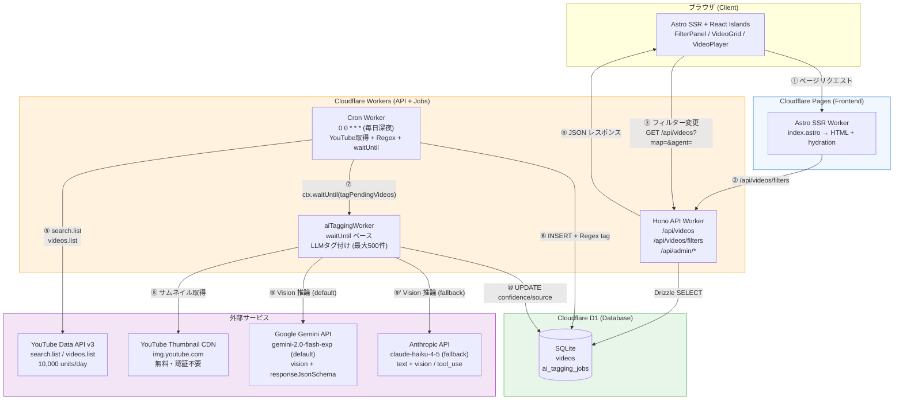
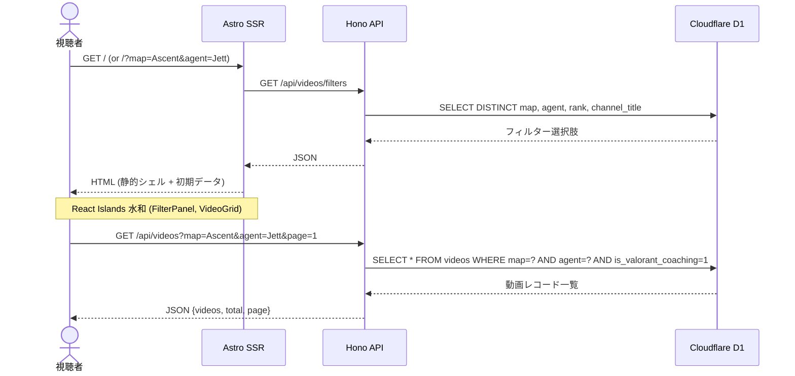
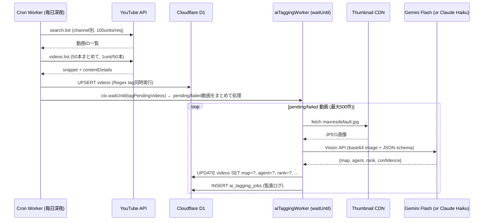
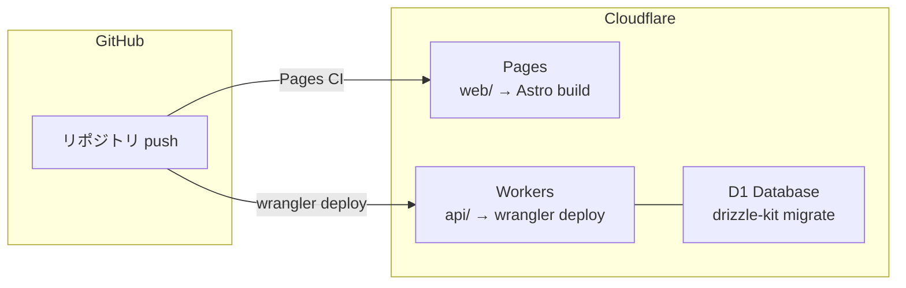

# ValoCoach Archive — アーキテクチャ図

## システム全体図



## データフロー詳細

### フロー①〜④: ユーザーの動画閲覧



### フロー⑤〜⑩: YouTube同期 + AIタグ付け



> **注**: 字幕LLM (caption_llm) はYouTube字幕取得不可のためデフォルトスキップ。
> `skipCaptionLLM === false` で明示指定した場合のみ実行。

## コンポーネント責務

| コンポーネント | 責務 | 技術 |
|---|---|---|
| Astro SSR | 初期ページレンダリング・SEO・フィルター選択肢取得 | Astro 5 + Cloudflare adapter |
| FilterPanel | map/agent/rank/coachフィルターUI・URL params管理 | React + URL Search Params |
| VideoGrid | 動画カード一覧・ページング | React |
| VideoPlayer | YouTube iframe embed | React (client:visible) |
| Hono API | フィルタークエリ・Zod バリデーション・管理エンドポイント | Hono + Drizzle + D1 |
| Cron Worker | YouTube取得・Regexタグ付け・waitUntil でLLMタグ付けトリガー | Hono scheduled handler |
| aiTaggingWorker | pending/failed動画のLLMタグ付け・DB更新 (waitUntilベース) | TypeScript (Queues不要) |
| Regex Extractor | タイトル/タグ/説明から単語境界マッチで抽出（無料・同期） | TypeScript regex |
| Caption Fetcher | YouTube Timedtext VTTを取得・整形 (デフォルトスキップ) | fetch() |
| Caption LLM | テキスト解析・構造化出力 (デフォルトスキップ) | fetch() → Gemini / Anthropic API |
| Thumbnail LLM | Vision でサムネイル解析・構造化出力 (デフォルト実行) | fetch() → Gemini / Anthropic API |
| Pipeline | 2段階抽出の統合・信頼度重みによるマージ | TypeScript |

## 管理エンドポイント一覧

| エンドポイント | メソッド | 用途 |
|---|---|---|
| `/api/admin/sync` | POST | 手動Cronトリガー (waitUntil) |
| `/api/admin/test-collect` | POST | 最大N動画収集+LLM即時実行（検証用） |
| `/api/admin/search-collect` | POST | クエリ検索で収集+DB保存 |
| `/api/admin/retag/:videoId` | POST | 単体再タグ付け (waitUntil) |
| `/api/admin/retag-batch` | POST | pending/failed一括タグ付け (waitUntil) |
| `/api/admin/videos/:videoId/reject` | POST | 偽陽性を非表示 (is_valorant_coaching=0) |
| `/api/admin/videos/:videoId/restore` | POST | 非表示を元に戻す (is_valorant_coaching=1) |

## デプロイ構成



## 環境変数・シークレット

| 変数名 | スコープ | 用途 |
|---|---|---|
| `YOUTUBE_API_KEY` | Workers secret | YouTube Data API v3 認証 |
| `GEMINI_API_KEY` | Workers secret | Gemini Flash API 認証 (default LLM) |
| `ANTHROPIC_API_KEY` | Workers secret | Claude Haiku API 認証 (fallback LLM) |
| `SYNC_SECRET` | Workers secret | /api/admin/* 保護 (Bearer トークン) |
| `LLM_PROVIDER` | Workers vars (wrangler.toml) | `"gemini"` または `"anthropic"` で切り替え |
| `API_BASE_URL` | Pages env | AstroからHono APIへのベースURL |

設定方法:
```bash
wrangler secret put YOUTUBE_API_KEY
wrangler secret put GEMINI_API_KEY
wrangler secret put ANTHROPIC_API_KEY
wrangler secret put SYNC_SECRET
# LLM_PROVIDER は wrangler.toml の [vars] で設定 (secret不要)
```
