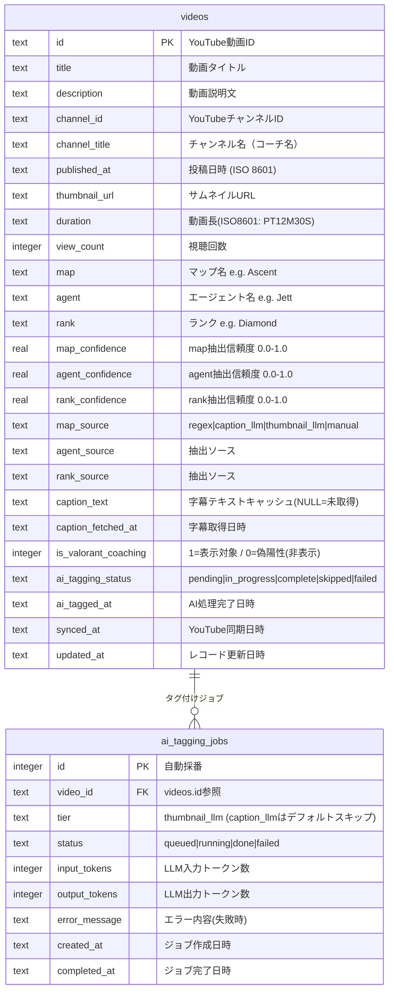

# ValoCoach Archive — ER図

## ER図



## テーブル説明

### `videos`
YouTube動画のメタデータとAI抽出結果を保持するメインテーブル。

**主キー**: `id` — YouTube動画ID（例: `dQw4w9WgXcQ`）

**抽出メタデータ（map/agent/rank）**
各フィールドは2段階パイプラインで抽出される:
1. Regex（タイトル/タグ/説明）→ `*_source = 'regex'`, `*_confidence = 0.8`
2. Gemini Flash Vision サムネイル解析 → `*_source = 'thumbnail_llm'`, `*_confidence = 0.45`
3. Claude Haiku 字幕解析 → `*_source = 'caption_llm'`, `*_confidence = 0.65` (**デフォルトスキップ**)
4. 手動修正 → `*_source = 'manual'`, `*_confidence = 1.0`

**信頼度順位**: `manual(1.0)` > `regex(0.8)` > `caption_llm(0.65)` > `thumbnail_llm(0.45)`

**`is_valorant_coaching` フラグ**:
- `1` — コーチング動画として表示対象（デフォルト）
- `0` — 偽陽性として非表示（`/api/admin/videos/:id/reject` で設定）

**`ai_tagging_status` 遷移**:
```
pending → in_progress → complete
                      → failed
         skipped  ← (regex で全フィールド完成時)
```

**インデックス**:
- `idx_videos_map` — mapフィルタークエリ最適化
- `idx_videos_agent` — agentフィルタークエリ最適化
- `idx_videos_rank` — rankフィルタークエリ最適化
- `idx_videos_channel` — channel_idインデックス (coachフィルタークエリ最適化)
- `idx_videos_ai_status` — pendingジョブ一覧取得最適化
- `idx_videos_published` — 投稿日降順ソート最適化

### `ai_tagging_jobs`
AIタグ付けの実行ログ・監査テーブル。コスト追跡とリトライ管理に使用。

**`tier`**:
- `thumbnail_llm` — YouTubeサムネイルをGemini Flash Visionで解析（デフォルト実行）
- `caption_llm` — YouTube字幕テキストをLLMで解析（`skipCaptionLLM === false` の場合のみ）

**コスト試算クエリ例**:
```sql
SELECT
  tier,
  count(*) as jobs,
  sum(input_tokens) as total_input,
  sum(output_tokens) as total_output,
  round(sum(input_tokens) * 0.00025 / 1000 + sum(output_tokens) * 0.00125 / 1000, 4) as cost_usd
FROM ai_tagging_jobs
WHERE status = 'done'
GROUP BY tier;
```

## フィールド値定義

### map（全12マップ）
`Ascent` | `Bind` | `Breeze` | `Fracture` | `Haven` | `Icebox` | `Lotus` | `Pearl` | `Split` | `Sunset` | `Abyss` | `Corrode`

### agent（全27エージェント）
**Duelist**: `Jett` | `Reyna` | `Raze` | `Phoenix` | `Neon` | `Iso` | `Waylay`
**Initiator**: `Sova` | `Breach` | `Skye` | `KAY/O` | `Fade` | `Gekko` | `Tejo`
**Controller**: `Brimstone` | `Viper` | `Omen` | `Astra` | `Harbor` | `Clove`
**Sentinel**: `Sage` | `Cypher` | `Killjoy` | `Chamber` | `Deadlock` | `Vyse`

### rank（全9ランク）
`Iron` | `Bronze` | `Silver` | `Gold` | `Platinum` | `Diamond` | `Ascendant` | `Immortal` | `Radiant`
